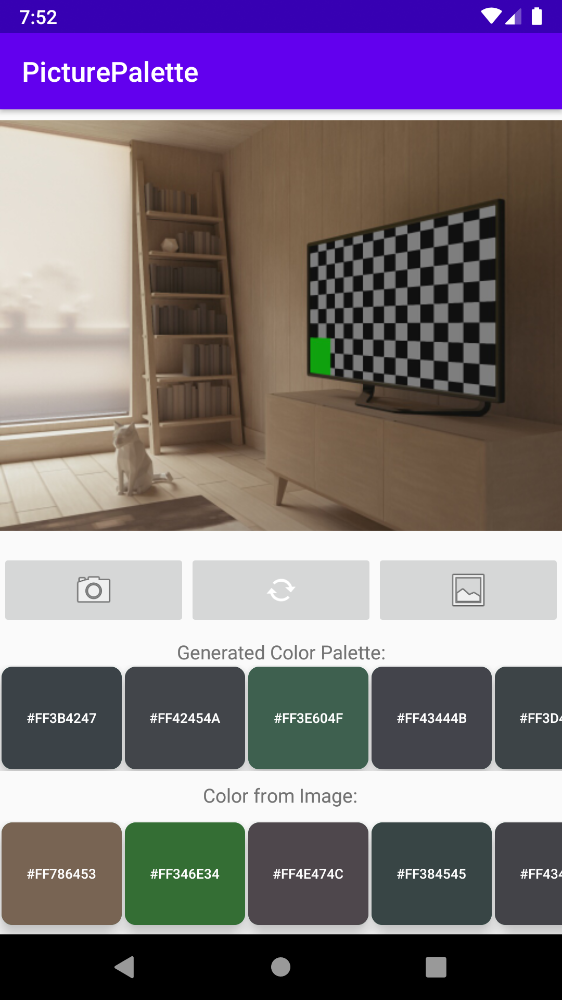

## About

Quantizes colors from an image and creates a color palette based on the colors extracted from the image.

## Overview
We extract the colors from the image using the K-means clustering algorithm. 
The algorithm works by creating groups or clusters and these clusters create an aggregate mean of the nearby data points. After we have extracted the five most dominant colors, we can then create a color space and use trilinear interpolation to generate a color palette.

## Demo

